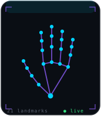

<!-- 🔗 SOCIAL LINKS -->

  
  
  

 

<!-- 🖐️ HERO: BINARY-FRAMED PORTRAIT + INTRO
     assets/hero-photo.svg = real photo (violet/cyan duotone) inside an animated binary scan frame.
     Regenerate with scratchpad/gen_hero_photo.py if the source photo changes. -->
<table align="center">
<tr>
<td width="240" align="center" valign="middle">

</td>
<td valign="middle">

# Koppula Varun

**`SOFTWARE ENGINEER · BACKEND & AI SYSTEMS`**

I build **backend infrastructure**, **AI-powered products**, and **real-time systems** — and I ship them to production.

</td>
</tr>
</table>

<!-- 🎯 STAT TILES -->

 

## 📍 Where I've Been

<table align="center" width="100%">
<tr>
<td width="33%" valign="top">

**🟣 2026 — Now**
#### Extendime Software Solutions Pvt. Ltd.
*Software Engineering Intern*

Shipping the production platform on **Next.js + AWS**, wiring up **CI/CD**, and hardening the backend APIs.

</td>
<td width="33%" valign="top">

**🟣 2026**
#### Suntek Corp Solutions Pvt. Ltd.
*MERN Stack Intern*

Lead builder of **Kairo** — a real-time collaborative code editor for concurrent teams.

</td>
<td width="33%" valign="top">

**🟣 2024 — 2028**
#### Anurag University
*B.Tech, CSE*

Computer Science & Engineering. Building things far beyond the syllabus.

</td>
</tr>
</table>

 

## 🚀 Featured Work

 

<!-- ⭐ FLAGSHIP: AirOS + gesture portrait -->
<table align="center" width="100%">
<tr>
<td width="200" align="center" valign="middle">

</td>
<td valign="middle">

### 🛰️ AirOS &nbsp;

**AI-powered, real-time gesture interaction system.** Control software with your hands — the portrait on the left is exactly what AirOS sees: **21 tracked landmarks**, live.

</td>
</tr>
</table>

 

<table align="center" width="100%">
<tr>
<td width="50%" valign="top">

### 🧩 Kairo
*Real-time collaborative code editor*

Multiple people, one editor, zero lag — **Socket.IO** rooms, **JWT + RBAC**, and local / Google / GitHub **OAuth**.

</td>
<td width="50%" valign="top">

### 💊 AyurTrace
*Full-stack distributed supply-chain platform · 🥇 Tejas*

An end-to-end system tracing the AYUSH supply chain, with a **blockchain trust layer** and **AI-powered recalls**.

</td>
</tr>
<tr>
<td width="50%" valign="top">

### 🩺 WoundCare
*Computer-vision wound healing analysis*

Upload a wound photo, get a healing read — an **OpenCV** pipeline (HSV masking, contour detection, pixel calibration) behind a **FastAPI** backend.

</td>
<td width="50%" valign="top">

### 🛡️ ConsentShield
*AI compliance & consent registry*

Protecting digital identities with **perceptual hashing** and an ethical-AI consent framework.

</td>
</tr>
<tr>
<td width="50%" valign="top">

### 🎬 Netflix Search Clone
*Unified multi-API discovery*

One search bar over **TMDB, RAWG & Steam** — aggregated search and recommendations across movies, games, and more.

</td>
<td width="50%" valign="top">

### 🤖 AccessNow
*Generative-AI Chrome extension*

Summarize and navigate the web on the fly with a **Google Gemini**-powered browsing assistant.

</td>
</tr>
</table>

 

## 🧰 Stack

### 
⌨️ Languages

  
  
  
  
  

### 
🎨 Frontend

  
  
  
  

### 
🛠️ Backend

  
  
  
  
  
  

### 
🗄️ Databases

  
  
  
  
  

### 
☁️ Cloud & DevOps

  
  
  
  
  

### 
🤖 AI & Computer Vision

  
  
  

### 
⛓️ Also In The Toolkit

  
  
  
  

 

## 📊 GitHub

 

<!-- ACTIVITY GRAPH -->

  

 

<!-- STATS LAYOUT: 2x2 table -->
<table align="center" width="95%">
<tr>
  <td width="50%" align="center" valign="top">
    
  </td>
  <td width="50%" align="center" valign="top">
    
  </td>
</tr>
<tr>
  <td width="50%" align="center" valign="top">
     
    
  </td>
  <td width="50%" align="center" valign="top">
    <!-- intentionally left blank for balance -->
  </td>
</tr>
</table>

 

## 📡 Open To

**Software Engineer · Backend Engineer · Full Stack Developer · AI Systems Builder**

Full-time, internships, and serious open-source or hackathon collaboration.
Fastest way to reach me is email — I reply within a day.

 

### 👁️ Profile Visitors

 

<!-- ANIMATED FOOTER WAVE -->

  

